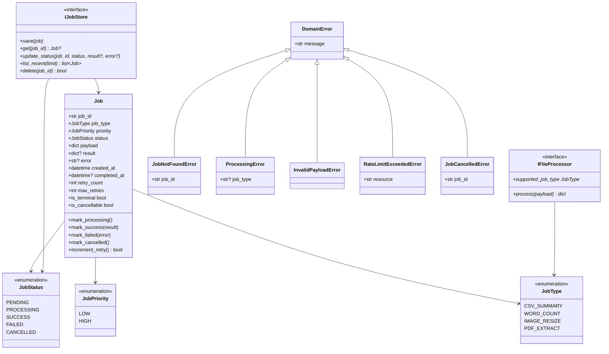
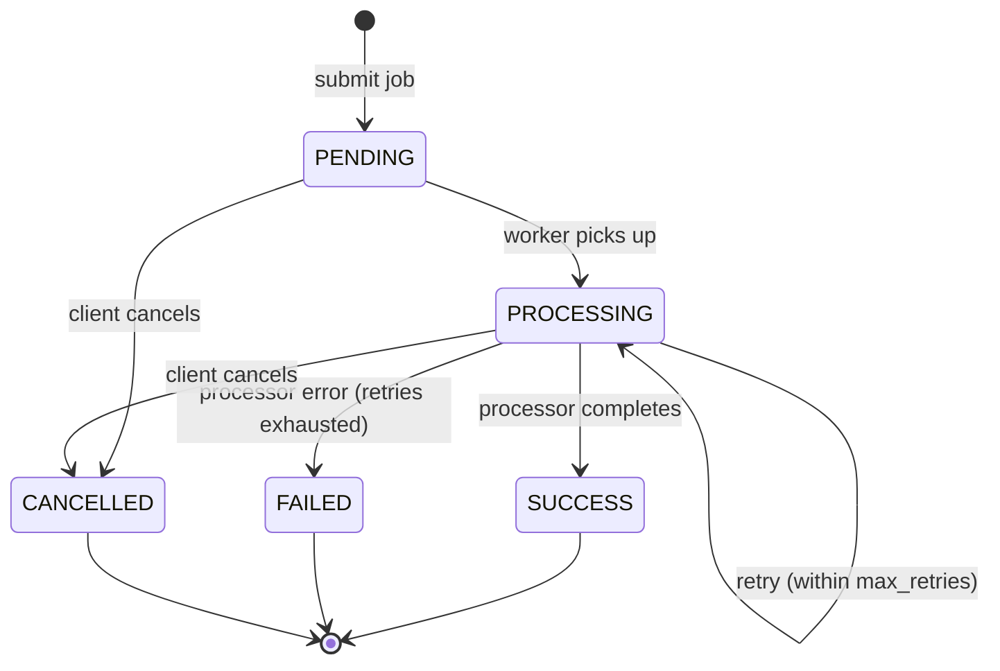

# Domain Model — Async Task Queue API

> **Stage 1 — Planner Agent**
> Domain model documentation for the File Processing Service.

---

## Class Diagram

---

## Job Lifecycle State Machine

---

## Layer Responsibilities

| Layer | Contents | Dependencies |
|-------|----------|--------------|
| **Domain** (`src/domain/`) | Job entity, enums, ports (ABCs), exceptions | None (pure Python) |
| **Application** (`src/application/`) | DTOs (Pydantic), use cases, mappers | Domain only |
| **Adapters** (`src/adapters/`) | FastAPI routes, Redis store, file processors | Application + Domain |
| **Infrastructure** (`src/infrastructure/`) | Celery, Redis client, config, rate limiter | Application + Domain |

**Dependency rule (inviolable):** `domain/ ← application/ ← adapters/` — domain imports nothing external.

---

## File Locations

| Artifact | File | Type |
|----------|------|------|
| Job entity | `src/domain/entities/job.py` | `@dataclass` |
| JobStatus, JobPriority, JobType | `src/domain/value_objects/enums.py` | `str, Enum` |
| IFileProcessor | `src/domain/ports/file_processor.py` | `ABC` |
| IJobStore | `src/domain/ports/job_store.py` | `ABC` |
| Domain exceptions | `src/domain/exceptions.py` | `Exception` subclasses |
| Request/Response DTOs | `src/application/dtos/job_dtos.py` | Pydantic `BaseModel` |
